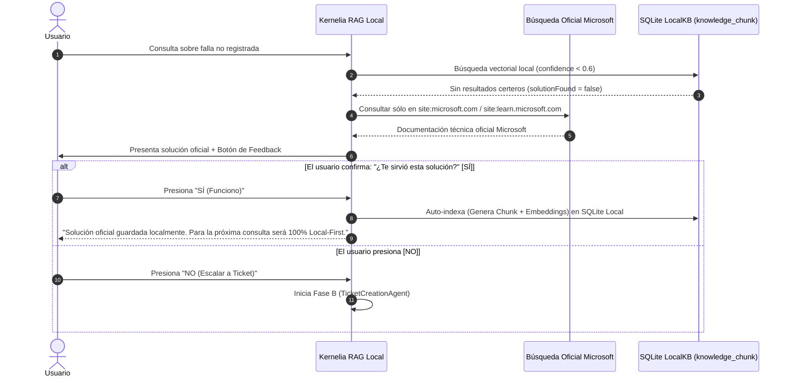

# Plan de Mejora RAG y Escalado de Incidencias para Kernelia
**Basado en la arquitectura del Manual Técnico (`docs/rag_tecnico.md`)**

---

## 📌 1. Diagnóstico Actual vs. Modelo Propuesto

| Componente | Estado Actual en Kernelia | Modelo Propuesto (`rag_tecnico.md`) | Impacto de la Mejora |
| :--- | :--- | :--- | :--- |
| **Búsqueda RAG** | Híbrida (Lexical + Cosine) con vector DB local | Búsqueda con umbral de similitud estricto (`minScore = 0.6`, `maxResults = 5`) | Elimina respuestas irrelevantes o contexto ruidoso. |
| **Evaluación de Solución** | Generación directa sin confirmación explícita | Salida estructurada `KnowledgeBaseResult` (`solutionFound`, `customerSatisfied`) | El LLM evalúa si la evidencia realmente resuelve la duda antes de responder. |
| **Búsqueda Web de Rescate** | Inexistente si la KB local falla | **Microsoft Official Whitelisted Web Search**: Búsqueda externa exclusiva en sitios Microsoft | Garantiza soluciones 100% verficadas, libres de malware o scripts dudosos. |
| **Auto-Aprendizaje (Self-Learning)** | Manual | **Web-to-Local Ingestion**: Guarda automáticamente en SQLite si el usuario valida la respuesta | Transforma respuestas oficiales de Microsoft en conocimiento **Local-First** para el futuro. |
| **Gestión de Fracasos** | Mensajes de fallback genéricos | Agente de Creación de Tickets (`TicketCreationAgent`) con priorización inteligente | Escala automáticamente a soporte humano con ticket categorizado si ni la KB ni Microsoft Web resuelven. |

---

## 🚀 2. Arquitectura de Implementación Propuesta para Kernelia

### Fase A: Pipeline RAG y Outputs Estructurados (`KnowledgeBaseAgent`)

1. **Definición de Contrato `KnowledgeBaseResult`**:
   - En lugar de devolver texto libre del LLM, la respuesta del backend Rust/IPC devuelve un objeto JSON estructurado:
     ```json
     {
       "solutionFound": true,
       "customerSatisfiedWithTheSolution": false,
       "confidenceScore": 0.88,
       "specialty": "Network",
       "sourceType": "local_kb",
       "message": "Para solucionar el problema de DNS, ejecuta en PowerShell...",
       "recommendedActions": [
         { "type": "automatic", "cmdlet": "clear_dns_cache_ps" },
         { "type": "manual", "step": "Reiniciar el router de fibra" }
       ]
     }
     ```
2. **Criterio Conservador de Inferencia**:
   - Si `confidenceScore < 0.6` o `solutionFound == false`, Kernelia no especula. Se activa automáticamente la **Fase D (Búsqueda Web Oficial Microsoft)**.

---

### Fase D: Módulo de Búsqueda Exclusiva en Fuentes Oficiales de Microsoft

Para garantizar la **máxima seguridad e integridad técnica en sistemas Windows**, el módulo de búsqueda web restringe estrictamente las consultas a los dominios autorizados de Microsoft:

#### 🔒 Dominios Permitidos (Whitelisted Microsoft Domains):
- `learn.microsoft.com` (Documentación técnica oficial y cmdlets de PowerShell)
- `support.microsoft.com` (Artículos de KB y guiados de soporte técnico Windows)
- `answers.microsoft.com` (Foros oficiales de la comunidad de soporte Microsoft)
- `techcommunity.microsoft.com` (Blogs y guías de ingenieros de infraestructura Microsoft)

#### 🔍 Modificador Estricto de Búsqueda Web:
```text
site:learn.microsoft.com OR site:support.microsoft.com OR site:answers.microsoft.com OR site:techcommunity.microsoft.com
```

---

### Fase E: Módulo de Auto-Aprendizaje Web-to-Local (*Self-Learning Web Ingestion Pipeline*)

Este flujo responde a la necesidad de **aprender dinámicamente de portales oficiales de Microsoft y memorizar localmente**:



1. **Búsqueda Web Filtrada**:
   - Kernelia ejecuta la consulta enriquecida con los modificadores de dominio oficial de Microsoft.
2. **Sanitización y Presentación**:
   - El modelo local analiza la documentación oficial de Microsoft, valida los cmdlets de PowerShell y los presenta estructurados con botones interactivos:
     - `[ 👍 Sí, resolvió mi problema ]`
     - `[ 👎 No, crear ticket con técnico ]`
3. **Persistencia Automática Local-First**:
   - Si el usuario presiona **"Sí"**, el backend de Rust procesa automáticamente el problema y la solución oficial:
     - Fragmenta el artículo (`DocumentBySentenceSplitter`).
     - Genera vectores de embedding (`AllMiniLmL6V2`).
     - Inserta en SQLite (`knowledge_chunk` y `knowledge_chunk_embedding`).
   - **Resultado**: La próxima vez que cualquier usuario pregunte lo mismo, la respuesta se entregará **instantáneamente de forma 100% Local-First**, sin internet y respaldada por fuentes oficiales Microsoft.

---

### Fase B: Sistema Integrado de Ticketing y Priorización Automática (`TicketCreationAgent`)

Cuando ni la KB local ni las fuentes oficiales de Microsoft logran resolver el problema:

1. **Clasificación de Prioridad por Impacto**:
   - **ALTA**: Equipo inoperativo, corte total de red/internet en servidor o fallo de arranque.
   - **MEDIA**: Degradación parcial de velocidad, fallo en servicios no críticos (Spooler de impresión).
   - **BAJA**: Consultas de configuración, dudas de aplicaciones o mejoras de UI.
2. **Generación de `TicketCreationResult`**:
   - El sistema compila automáticamente:
     - **ID de Incidencia** (UUID).
     - **Prioridad**.
     - **Resumen Técnico** (con la telemetría recolectada de la máquina: IP, RAM, CPU, errores).
     - **Mensaje de Confirmación al Usuario** (tranquilizador, sin promesas falsas de SLA).
3. **Persistencia de Incidencias en SQLite**:
   - Se crea la tabla `support_ticket` en la base de datos `nexus-lite/rag/kernelia_rag.db`.

---

### Fase C: Ciclo de Realimentación Continua (*Feedback Loop*)

1. **Conversión de Tickets Resueltos a Conocimiento KB**:
   - Cuando un técnico o el superusuario marca un ticket como `RESUELTO`, un script de ingesta procesa la solución y la convierte en un nuevo chunk de conocimiento en la tabla `knowledge_chunk`.
2. **Tablero de Métricas de Soporte**:
   - **Tasa de Autoresolución (%)**: Porcentaje de problemas resueltos por Kernelia sin intervención humana.
   - **Tasa de Aprendizaje Microsoft Web-to-Local**: Número de artículos oficiales adquiridos e integrados a local.
   - **Precisión de KB (%)**: Porcentaje de soluciones propuestas aceptadas por los usuarios.

---

## 🛠️ 3. Hoja de Ruta de Desarrollo para Kernelia

1. **Extender el esquema SQLite RAG**:
   - Agregar tabla `support_ticket` y `ticket_kb_ingest_log`.
2. **Implementar Conector Filtrado `microsoft_web_search.rs`**:
   - Búsqueda restringida exclusivamente a `learn.microsoft.com`, `support.microsoft.com`, `answers.microsoft.com`, `techcommunity.microsoft.com`.
3. **Endpoint de Auto-Ingesta `ingest_user_validated_solution`**:
   - Inserción dinámica de embeddings en SQLite tras la confirmación del usuario.
4. **Conectar Interfaz Svelte con el Flujo de Feedback**:
   - Agregar botones `[👍 Funcionó]` / `[👎 Escalar a Ticket]` en la burbuja de chat.
