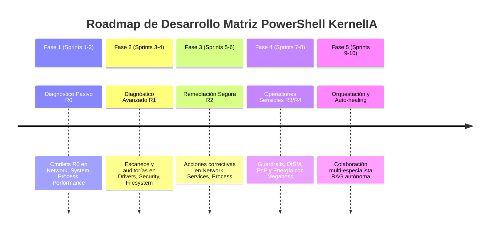

# Roadmap de Desarrollo por Fases: Matriz PowerShell en Agentes Especialistas de KernelIA

Este documento define la hoja de ruta oficial (**Master Roadmap**) para desarrollar, integrar y validar la matriz completa de comandos **PowerShell** dentro de los 8 Agentes Especialistas de **KernelIA**.

---

## Resumen del Roadmap

---

## Fase 1: Fundamentos de Diagnóstico Pasivo (Riesgo R0)
**Duración**: Sprints 1 y 2  
**Objetivo**: Habilitar la recolección pasiva de información y métricas de salud en tiempo real sin alterar la configuración del sistema.

### Especialistas Impactados
- **`NetworkAgent`**: `Get-NetIPConfiguration`, `Get-NetAdapter`, `Get-NetTCPConnection`.
- **`SystemAgent`**: `Get-ComputerInfo`, `Get-HotFix`, `Get-CimInstance Win32_Bios`.
- **`ProcessAgent`**: `Get-Process` (Top CPU y Top RAM), `Get-CimInstance Win32_Process`.
- **`PerformanceAgent`**: `Get-Counter` (CPU, Memory, Disk), `Get-CimInstance Win32_OperatingSystem`.

### Hitos y Entregables
1. [x] Crear wrappers nativos en Rust (`src-tauri/src/tools/powershell.rs`) con ejecución `ConvertTo-Json -Compress`.
2. [x] Validar que la ejecución no requiera elevación de privilegios de administrador.
3. [x] Integrar resultados en el contexto de consulta RAG (`live_state_retriever`).

---

## Fase 2: Diagnóstico Avanzado e Inspección de Errores (Riesgo R1)
**Duración**: Sprints 3 y 4  
**Objetivo**: Implementar escaneos activos, detección de fallos de controladores y auditoría de eventos críticos de Windows.

### Especialistas Impactados
- **`DriversAgent`**: `Get-PnpDevice -Status Error,Unknown`, `pnputil /enum-drivers`.
- **`SecurityAgent`**: `Get-MpComputerStatus`, `Get-WinEvent` (Event ID 4625 y Errores de Sistema).
- **`FilesystemAgent`**: `Get-PhysicalDisk` (Estado SMART), `Repair-Volume -Scan`.
- **`ServicesAgent`**: `Get-Service` (Filtro de servicios automáticos detenidos).

### Hitos y Entregables
1. [x] Parser de logs de eventos de Windows (`Get-WinEvent`) estructurado en JSON.
2. [x] Detección automática de dispositivos en fallo con código de error PnP (ej. Código 43).
3. [x] Registro de evidencias de diagnóstico en el motor de trazas (`trace_engine.rs`).

---

## Fase 3: Remediación Segura y Acciones Correctivas (Riesgo R2)
**Duración**: Sprints 5 y 6  
**Objetivo**: Desplegar acciones correctivas no destructivas con captura obligatoria de evidencia Pre/Post.

### Especialistas Impactados
- **`NetworkAgent`**: `Clear-DnsClientCache`, `Restart-NetAdapter`.
- **`ServicesAgent`**: `Start-Service`, `Stop-Service`, `Restart-Service`, `Clear-Spooler-Jobs`.
- **`ProcessAgent`**: `Stop-Process -Force` (con lista blanca de protección de procesos del Kernel).
- **`FilesystemAgent`**: `Optimize-Volume` (TRIM / Defrag).

### Hitos y Entregables
1. [ ] Implementación de regla de pre-condición `CRITICAL_PROCESS_PROTECTION` para evitar matar procesos del sistema operativo.
2. [ ] Captura automática de `tool_evidence_rule` (estado antes y después de reiniciar servicio o red).
3. [ ] Confirmación rápida desde la UI de SvelteKit para acciones `R2`.

---

## Fase 4: Operaciones Sensibles y Guardrails del Kernel (Riesgo R3 / R4)
**Duración**: Sprints 7 y 8  
**Objetivo**: Habilitar herramientas avanzadas de reparación y control de energía bajo verificación estricta y perfil Megaboss.

### Especialistas Impactados
- **`SecurityAgent` / `SensitiveOps`**: `Disable-PnpDevice`, `pnputil /delete-driver`.
- **`SystemAgent`**: `DISM /Online /Cleanup-Image /RestoreHealth`, `sfc /scannow`.
- **`SensitiveOps`**: `shutdown /r /t 0`, `shutdown /s /t 0`.

### Hitos y Entregables
1. [x] Simulación previa obligatoria (`supports_dry_run`) antes de ejecutar reparaciones de DISM o borrado de drivers.
2. [x] Verificación de autenticación de rol `Megaboss` y token de seguridad en `tool_verifier.rs`.
3. [x] Registro auditado inmutable en la base SQLite de KernelIA.

---

## Fase 5: Orquestación Autónoma Multi-Especialista y Auto-healing
**Duración**: Sprints 9 y 10  
**Objetivo**: Lograr que los Agentes Especialistas colaboren autónomamente para diagnosticar y solucionar problemas complejos.

### Escenario de Orquestación Ejemplo
1. `PerformanceAgent` detecta ralentización del sistema y pasa evidencia a `ProcessAgent`.
2. `ProcessAgent` identifica que la causa es un servicio atascado en `Spooler` y transfiere el control a `ServicesAgent`.
3. `ServicesAgent` limpia la cola de impresión y reinicia el servicio.
4. `SystemAgent` emite el informe consolidado final al usuario con la traza RAG completa.

### Hitos y Entregables
1. [ ] Enrutamiento multi-especialista en `specialty_router.rs`.
2. [ ] Generación automática de documentación operacional de la intervención.
