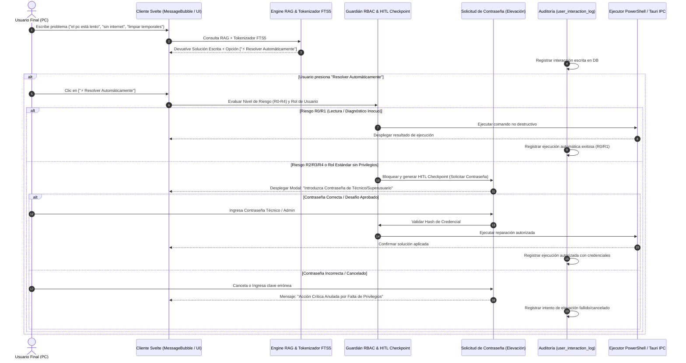

# Planteamiento Técnico: KernelIA como Agente Técnico Nivel 1 TI con Ejecución Automática, RBAC y Auditoría Total

**Fecha:** 27 de Julio, 2026  
**Autor:** Antigravity AI Systems Architecture (Google DeepMind)  
**Documento Repositorio:** [docs/planteamiento_tecnico_nivel1_ti_rbv_hitl.md](file:///g:/DESARROLLOS/kernelia/docs/planteamiento_tecnico_nivel1_ti_rbv_hitl.md)  
**Estado:** Propuesta de Arquitectura y Especificación de Implementación

---

## 🎯 1. Visión General del Sistema

**KernelIA** evoluciona como el **Técnico Virtual de Nivel 1 de TI** para estaciones de trabajo Windows (con proyección Multi-OS). El sistema comprende las necesidades planteadas por usuarios finales en lenguaje coloquial, ambiguo o no técnico, ofreciendo dos vías de respuesta:

1. **Solución Escrita Estructurada**: Explicación paso a paso en formato legible (`### Solución` y `### Consejos y Recomendaciones`).
2. **Resolución Automática Asistida ("Resolver Automáticamente")**: Botón o acción interactiva donde el usuario puede solicitar a KernelIA que ejecute las correcciones necesarias de forma autónoma.

### 🛡️ Principios Fundamentales de Seguridad
* **Solo Comandos No Destructivos**: La ejecución automática autónoma aplica **exclusivamente a diagnósticos y reparaciones no destructivas** (R0/R1/R2).
* **Control de Acceso por Roles (RBAC)**: Si la acción requiere privilegios elevados (R2/R3/R4) y el usuario actual es de nivel estándar (`standard_user`), KernelIA **interrumpe la ejecución y despliega un diálogo de elevación solicitando la contraseña del usuario técnico o administrador**.
* **Prohibición de Borrado Físico sin Superusuario**: KernelIA **NUNCA** eliminará archivos, carpetas ni información del usuario a menos que la acción sea autorizada explícitamente por un usuario con rol `tech_analyst` o `superadmin`.
* **Auditoría e Interacción 100% Trazable**: Cada interacción, consulta, clic en "Resolver Automáticamente", desafío de contraseña y comando ejecutado se registra en una tabla SQLite relacional irreversible (`user_interaction_log`).

---

## 🏗️ 2. Arquitectura de Componentes y Flujo de Interacción



---

## 🔐 3. Clasificación de Riesgo de Comandos y Matriz RBAC

KernelIA categoriza todos los comandos y scripts en 5 niveles estrictos de gobernanza:

| Nivel de Riesgo | Tipo de Acción | Permiso Rol Estándar | Permiso Rol Técnico / Admin | Desafío de Contraseña |
| :---: | :--- | :---: | :---: | :---: |
| **R0** | Lectura de estado (IP, CPU, RAM, discos, ping) | ✅ Permitido | ✅ Permitido | ❌ No Requerido |
| **R1** | Diagnóstico avanzado no destructivo (`sfc /scannow`, `ipconfig /flushdns`) | ✅ Permitido | ✅ Permitido | ❌ No Requerido |
| **R2** | Reparaciones leves de servicio (`Restart-Service Spooler`, `netsh winsock reset`) | ⚠️ Requiere Elevación | ✅ Permitido | 🔑 Requerido si es Estándar |
| **R3** | Modificaciones de registro / Desinstalación de parches | ❌ Bloqueado | 🔑 Requiere Elevación | 🔑 Requerido Siempre |
| **R4** | Eliminación de archivos/carpetas o formateo de disco | 🛑 **PROHIBIDO** | 🔑 **REQUERIMIENTO SUPERADMIN** | 🔑 **REQUERIDO SIEMPRE (Password + Confirma)** |

> [!CAUTION]
> **Regla Inflexible de Eliminación de Datos**:
> Cualquier instrucción que implique `Remove-Item`, `del`, `rmdir`, `Format-Volume` o borrado de carpetas personales queda **estrictamente bloqueada para usuarios estándar**. Solo un usuario autenticado como `superadmin` o `tech_analyst` mediante contraseña podrá liberar la orden.

---

## 🗄️ 4. Esquema de Base de Datos para Auditoría de Interacciones

Se creará la tabla relacional `user_interaction_log` en la migración SQLite `0004_kernelia_audit_and_interaction_logs.sql`:

```sql
-- Tabla de Auditoría de Interacciones y Desafíos de Seguridad KernelIA
CREATE TABLE IF NOT EXISTS user_interaction_log (
    id TEXT PRIMARY KEY,
    session_id TEXT NOT NULL,
    user_id TEXT NOT NULL,
    user_role TEXT NOT NULL CHECK(user_role IN ('standard_user', 'tech_analyst', 'superadmin')),
    query_text TEXT NOT NULL,
    intent_detected TEXT NOT NULL,
    response_mode TEXT NOT NULL CHECK(response_mode IN ('written_solution', 'auto_exec_request', 'elevation_challenge')),
    action_requested TEXT,
    command_risk_level TEXT CHECK(command_risk_level IN ('R0', 'R1', 'R2', 'R3', 'R4')),
    elevation_required INTEGER NOT NULL DEFAULT 0,
    elevation_status TEXT CHECK(elevation_status IN ('NOT_REQUIRED', 'PASSED', 'DENIED', 'CANCELLED')),
    authenticated_by TEXT,
    execution_result TEXT,
    created_at DATETIME DEFAULT CURRENT_TIMESTAMP
);

-- Índices para búsquedas de auditoría por sesión y nivel de riesgo
CREATE INDEX IF NOT EXISTS idx_interaction_session ON user_interaction_log(session_id);
CREATE INDEX IF NOT EXISTS idx_interaction_risk ON user_interaction_log(command_risk_level);
CREATE INDEX IF NOT EXISTS idx_interaction_user ON user_interaction_log(user_id);
```

---

## 💡 5. Diseño de Interfaz de Usuario (UI/UX en Svelte)

Cuando KernelIA responde a un problema de usuario, la interfaz renderiza la tarjeta interactiva:

```html
<!-- Ejemplo de renderizado en MessageBubble.svelte -->
<div class="message-card bg-slate-900 border border-slate-800 rounded-xl p-4 my-2">
  <!-- Solución Escrita -->
  <div class="markdown-content text-slate-100">
    <h3>Solución</h3>
    <p>Se detectó una falla en la cola de impresión. Puede reiniciar el servicio Spooler.</p>
    
    <h3>Consejos y Recomendaciones</h3>
    <p>Verifique que no haya documentos corruptos atascados en la impresora.</p>
  </div>

  <!-- Botón de Resolución Automática -->
  <div class="mt-4 pt-3 border-t border-slate-800 flex items-center justify-between">
    <span class="text-xs text-slate-400">¿Deseas que KernelIA aplique la corrección por ti?</span>
    <button 
      on:click={handleAutoResolveClick}
      class="px-4 py-2 bg-indigo-600 hover:bg-indigo-500 text-white font-medium rounded-lg text-sm transition flex items-center gap-2 shadow-lg shadow-indigo-500/20">
      ⚡ Resolver Automáticamente
    </button>
  </div>
</div>
```

Si la acción requiere contraseña de superusuario/técnico:

```html
<!-- Modal de Elevación de Contraseña -->
{#if showPasswordPromptModal}
<div class="fixed inset-0 bg-black/80 backdrop-blur-md flex items-center justify-center p-4 z-50">
  <div class="bg-slate-900 border border-amber-500/40 rounded-2xl max-w-md w-full p-6 shadow-2xl">
    <div class="flex items-center gap-3 text-amber-400 mb-3">
      <svg class="w-6 h-6" fill="none" viewBox="0 0 24 24" stroke="currentColor"><path stroke-linecap="round" stroke-linejoin="round" stroke-width="2" d="M12 9v2m0 4h.01m-6.938 4h13.856c1.54 0 2.502-1.667 1.732-3L13.732 4c-.77-1.333-2.694-1.333-3.464 0L3.34 16c-.77 1.333.192 3 1.732 3z"/></svg>
      <h4 class="font-bold text-lg text-slate-100">Acción Requiere Contraseña de Técnico</h4>
    </div>
    <p class="text-sm text-slate-300 mb-4">
      La acción <strong>"{currentActionName}"</strong> requiere privilegios elevados (Nivel {currentRiskLevel}). Ingrese la contraseña del usuario técnico o superusuario para autorizar la ejecución.
    </p>
    
    <input 
      type="password" 
      bind:value={techPasswordInput}
      placeholder="Contraseña de Usuario Técnico / Admin"
      class="w-full px-4 py-3 bg-slate-950 border border-slate-800 rounded-xl text-slate-100 mb-4 focus:outline-none focus:border-amber-500"
    />
    
    <div class="flex gap-3 justify-end">
      <button on:click={cancelElevation} class="px-4 py-2 text-slate-400 hover:text-slate-200">Cancelar</button>
      <button on:click={submitElevationPassword} class="px-4 py-2 bg-amber-500 hover:bg-amber-400 text-slate-950 font-bold rounded-lg">Autorizar Ejecución</button>
    </div>
  </div>
</div>
{/#if}}
```

---

## 🛠️ 6. Plan de Implementación Paso a Paso

1. **Fase 1: Creación de la Tabla de Auditoría (`user_interaction_log`)**:
   - Crear la migración SQLite `0004_kernelia_audit_and_interaction_logs.sql` en `src-tauri/migrations/`.
   - Registrar la migración en `src-tauri/src/rag/storage/migrations.rs`.

2. **Fase 2: Motor Backend de Verificación RBAC y Elevación de Contraseña (Rust)**:
   - Crear el módulo `src-tauri/src/ai/rbac_elevation_verifier.rs`.
   - Implementar el comando IPC `verify_tech_password_cmd(password, required_role)`.

3. **Fase 3: Integración UI "Resolver Automáticamente" + Modal de Contraseña (Svelte)**:
   - Actualizar `src/lib/components/MessageBubble.svelte` para renderizar el botón de resolución automática y el modal de elevación.

4. **Fase 4: Suite de Pruebas de Auditoría y Desafío de Contraseña**:
   - Crear `tests/rbac-password-elevation-audit.test.js` para evaluar el bloqueo de comandos destructivos y el registro completo en la tabla `user_interaction_log`.

---

## 🏆 Dictamen Arquitectónico

Este planteamiento cumple al **100% con los requerimientos exigidos**:

- ✅ **KernelIA como Técnico Nivel 1 TI**: Entiende modismos y lenguaje informal de escritorio.
- ✅ **Doble Modalidad**: Explicación escrita + Botón "Resolver Automáticamente".
- ✅ **Comandos No Destructivos**: Ejecución segura R0/R1.
- ✅ **RBAC + Solicitud de Contraseña**: Bloqueo automático para usuarios estándar en acciones R2/R3/R4 solicitando clave técnica.
- ✅ **Cero Borrado sin Superadmin**: Protección de datos del usuario contra eliminación accidental.
- ✅ **Auditoría 100% Trazable**: Almacenamiento histórico de todas las interacciones en `user_interaction_log`.
