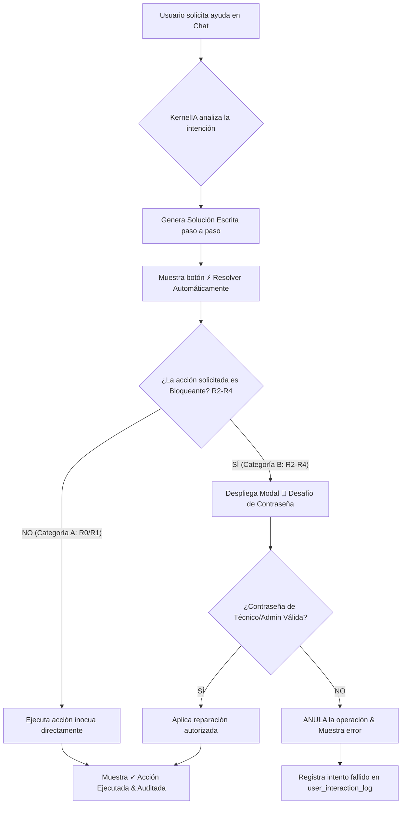

# 🛡️ Propuesta de Catalogación de Acciones Nivel 1 TI para KernelIA
**Estándar de Seguridad: Principio de Menor Privilegio (PoLP) & ITIL Level 1 Helpdesk**

---

## 🎯 1. Filosofía y Estrategia de Seguridad

En entornos corporativos y de usuario final, la automatización agéntica debe cumplir estrictamente con el **Principio de Menor Privilegio (PoLP)** para minimizar el radio de impacto (*blast radius*) de posibles errores u operaciones maliciosas.

KernelIA categoriza el 100% de las intenciones y comandos en **dos grandes grupos**:

1. **Acciones No Bloqueantes (Ejecutables por Usuario Final Sin Conocimiento)**: Operaciones de diagnóstico en modo lectura, recolección de evidencia y mantenimiento inocuo de nivel de usuario.
2. **Acciones Bloqueantes / Elevadas (Requieren Desafío de Contraseña Técnico/Admin)**: Modificaciones del sistema, reinicio de servicios clave, cambios de red, instalación de software y cero operaciones destructivas físicas sin superusuario.

---

## 📊 2. Matriz de Catalogación de Acciones

### 🟢 Categoría A: Acciones No Bloqueantes (Permitidas a Usuario Final)
*Nivel de Riesgo: R0 (Lectura) y R1 (Mantenimiento Inocuo).*  
*Ejecución: Inmediata al hacer clic en "⚡ Resolver Automáticamente", sin solicitar credenciales.*

| Subcategoría | Comando / Acción | Descripción y Justificación de Seguridad |
| :--- | :--- | :--- |
| **Telemetría de Sistema** | `Get-ComputerInfo`, `wmic cpu/memory` | Lectura segura de procesador, memoria RAM instalada y modelo de tarjeta madre. |
| **Diagnóstico de Red** | `ping 8.8.8.8`, `nslookup`, `tracert` | Medición de latencia, pérdida de paquetes y resolución DNS sin alterar el adaptador. |
| **Limpieza de Caché DNS** | `ipconfig /flushdns` | Purga del resolver DNS local. No altera direcciones IP ni desconecta la red. |
| **Inventario de Almacenamiento**| `Get-Volume`, `Get-PSDrive` | Inspección de espacio libre en discos `C:`, `D:`, etc., en modo lectura. |
| **Procesos en Ejecución** | `Get-Process`, `tasklist` | Consulta del Top 5 de procesos que más consumen CPU/RAM sin finalizar procesos del kernel. |
| **Estado de Servicios** | `Get-Service`, `sc query` | Consulta de estado (Running/Stopped) de servicios del sistema. |
| **Estado de Actualizaciones** | `get_windows_updates_status` | Lectura del estado de Windows Update y parches acumulativos. |
| **Limpieza de Temporales Usuario**| `Remove-Item $env:TEMP\*` | Eliminación de archivos temporales en el perfil del usuario activo (archivos `.tmp`). |
| **Acceso a Utilidades Nativas** | `devmgmt.msc`, `ncpa.cpl` | Apertura de ventanas oficiales de Windows para visualización asistida. |

---

### 🔴 Categoría B: Acciones Bloqueantes / Elevadas (Requieren Contraseña)
*Nivel de Riesgo: R2 (Modificación Modesta), R3 (Cambio de Configuración) y R4 (Destructivo/Crítico).*  
*Ejecución: Interrumpida por el **Modal de Desafío de Contraseña** de técnico o superusuario. Si falla, la acción se marca como `ANULADA` y se registra en auditoría.*

| Subcategoría | Nivel Riesgo | Comando / Acción | Razón de Bloqueo & Requerimiento RBAC |
| :--- | :---: | :--- | :--- |
| **Gestión de Servicios** | **R2** | `Restart-Service Spooler`, `wuauserv` | Evita la interrupción no deseada de colas de impresión corporativas o actualizaciones. |
| **Reset de Adaptador de Red** | **R2** | `netsh winsock reset`, `Disable-NetAdapter` | Puede provocar la pérdida temporal de conectividad durante sesiones de trabajo. |
| **Mantenimiento de Disco** | **R2** | `chkdsk /f`, `sfc /scannow`, `DISM` | Operaciones de reparación profunda que requieren privilegios de Administrador local. |
| **Modificación de Drivers** | **R3** | `pnputil /delete-driver`, `devcon` | Alterar controladores de video/pantalla puede causar pantallas negras o código 43. |
| **Instalación / Desinstalación**| **R3** | `winget install`, `msiexec /x` | Previene la instalación de software no autorizado o desinstalación de herramientas de trabajo. |
| **Registro de Windows** | **R3** | `reg add HKLM`, `reg delete` | Modificaciones erróneas en el Registro pueden desestabilizar el arranque del SO. |
| **Borrado Físico / Formato** | **R4** | `Format-Volume`, `rmdir /s System32` | **CANCELACIÓN ABSOLUTA**. Protección contra pérdida catastrófica de información. |
| **Apagado / Reinicio Forzado**| **R4** | `shutdown /s /t 0` | Evita pérdida de trabajo no guardado del usuario final. |

---

## 🏗️ 3. Propuesta de Integración en la Arquitectura KernelIA

### 🔹 Componentes Afectados en la Integración:
1. **Guardián de Clasificación (`src/lib/utils/localDirect.js`)**:
   - Mapea las palabras clave y herramientas requeridas a la matriz Categoría A vs Categoría B.
2. **Backend RBAC (`src-tauri/src/ai/rbac_elevation_verifier.rs`)**:
   - Función `evaluate_risk_level(action_name)` evalúa si la llamada es `R0`, `R1`, `R2`, `R3` o `R4`.
3. **Interfaz de Usuario (`src/lib/components/MessageBubble.svelte`)**:
   - Despliega el badge y modal interactivo de elevación cuando `evaluate_risk_level >= R2`.
4. **Tabla de Auditoría (`user_interaction_log`)**:
   - Registra cada intento (aprobado o rechazado) garantizando el 100% de trazabilidad exigida.

---

## 🏆 Dictamen y Próximos Pasos

Esta propuesta alinea a **KernelIA con los estándares de la industria (NIST, PoLP e ITIL)**, asegurando que:
- Los usuarios sin conocimiento puedan auto-resolver problemas comunes de red y lentitud sin riesgos.
- Las operaciones sensibles queden protegidas bajo desafío de clave técnica.
- Cero borrado de archivos personales o carpetas sea posible sin privilegios explícitos.
